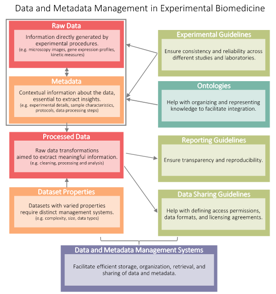

# How to organize large data

Set read-only permission for raw data

Metadata Management

I'm currently interested in the data organization, especially, I want to design an architecture or more simply, a conventional way to store data.

I have found this paper interesting:

"BEST PRACTICES FOR DATA MANAGEMENT AND SHARING IN EXPERIMENTAL BIOMEDICAL RESEARCH" (doi:10.1152/physrev.00043.2023)

So, I've decided to put more thought to this.

"Data preservation" - This is the first time I hear this term.

From a scientific perspective, two important principles are data integrity and reproducibility.

> Data management is essential for long-term data preservation and accessibility

I hope that from this review, I can learn to organize my data on HPC better.

Figure: Integrated view of key concepts in Data Management for Experimental Biomedicine

## Define raw data

> “raw data” refer to the original, unprocessed, and unaltered form of data that is collected or generated directly from its source, and can be also known as primary data

However, an opposing viewpoint argues that no data is truly "raw". This perspective holds that all data is processed in some manner during the collection or observation phasse.
