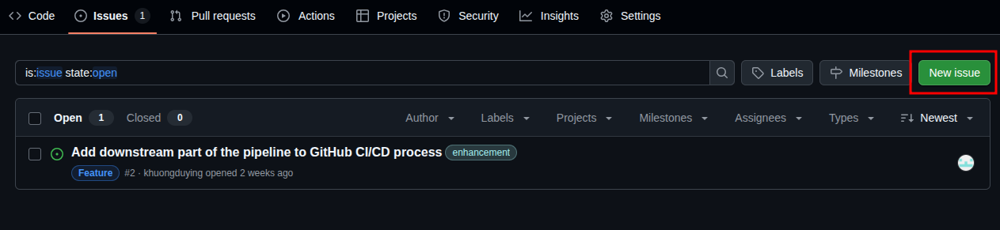
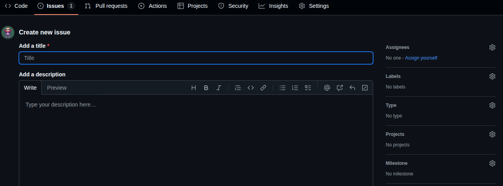
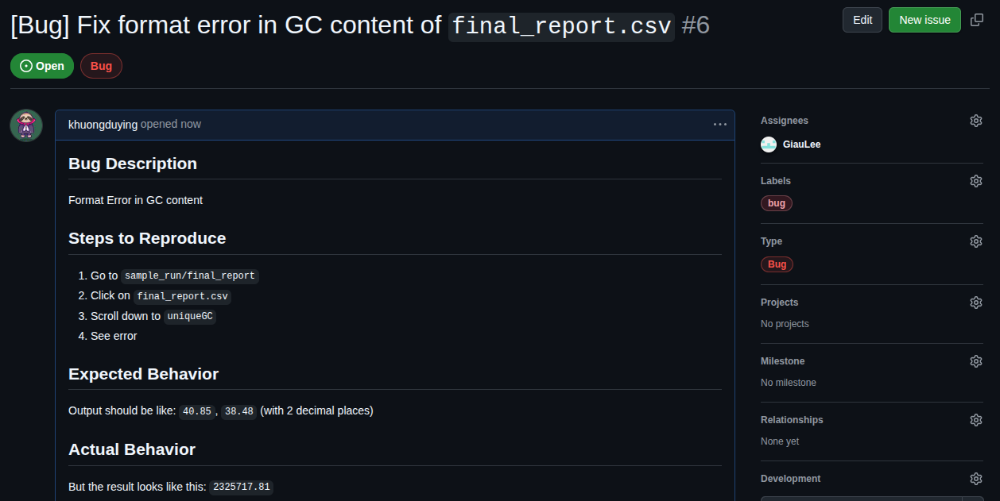

## Overview

Creating well-structured issues is crucial for effective project management and collaboration in GitHub repositories. This guide provides a comprehensive workflow for creating, describing, and managing issues.

## Step-by-Step Workflow for Creating Issues

### 1. Navigate to the Repository

- Go to the GitHub repository where you want to create an issue
- Click on the **"Issues"** tab in the repository navigation bar
- Click the **"New issue"** button (green button on the right)



### 2. Choose Issue Template (if available)

If the repository has issue templates:
- Select the appropriate template (Bug report, Feature request, Documentation, etc.)
- If no template fits, choose **"Open a blank issue"**



### 3. Write a Clear and Descriptive Title

**Best Practices for Titles:**

- Use imperative mood (e.g., "Fix login redirect bug" instead of "Login redirect is broken")
- Be specific and concise (50-72 characters recommended)
- Include relevant keywords for searchability
- Use prefixes when helpful: `[Bug]`, `[Feature]`, `[Documentation]`

**Examples:**
```
✅ Good: "Add user authentication middleware"
✅ Good: "[Bug] Navigation menu overlaps content on mobile"
❌ Bad: "Fix stuff"
❌ Bad: "There's a problem with the website"
```

### 4. Structure the Issue Description

Use this template structure for comprehensive issue descriptions:

#### For Bug Reports:

```markdown
## Bug Description
Brief summary of the bug.

## Steps to Reproduce
1. Go to '...'
2. Click on '....'
3. Scroll down to '....'
4. See error

## Expected Behavior
A clear description of what you expected to happen.

## Actual Behavior
A clear description of what actually happened.

## Screenshots/Videos
If applicable, add screenshots or videos to help explain the problem.

## Environment
- OS: [e.g. iOS, Windows 10, Ubuntu 20.04]
- Browser: [e.g. Chrome 91, Safari 14]
- Version: [e.g. v1.2.3]
- Device: [e.g. iPhone 12, Desktop]

## Additional Context
Add any other context about the problem here.

## Possible Solution
If you have ideas for fixing the bug, describe them here.
```


#### For Feature Requests:

```markdown
## Feature Summary
Brief description of the feature you'd like to see.

## Problem Statement
Describe the problem this feature would solve.

## Proposed Solution
Detailed description of how you envision this feature working.

## Alternative Solutions
Describe any alternative solutions you've considered.

## User Stories
- As a [user type], I want [functionality] so that [benefit]
- As a [user type], I want [functionality] so that [benefit]

## Acceptance Criteria
- [ ] Criteria 1
- [ ] Criteria 2
- [ ] Criteria 3

## Additional Context
Screenshots, mockups, or examples from other applications.
```

### 5. Add Labels

Apply relevant labels to categorize your issue:

- **Type**: `bug`, `enhancement`, `documentation`, `question`
- **Priority**: `low`, `medium`, `high`, `critical`
- **Status**: `needs-investigation`, `ready-for-development`, `in-progress`
- **Component**: `frontend`, `backend`, `api`, `database`

### 6. Assign the Issue

- **Assign to yourself** if you plan to work on it
- **Assign to team members** if you know who should handle it
- **Leave unassigned** if it needs triage

### 7. Set Milestone and Project

- Link to relevant **milestone** if the issue is part of a release
- Add to **project board** for better tracking and organization

### 8. Reference Related Issues and PRs

Use GitHub's linking syntax:

- `Fixes #123` - Links and auto-closes issue when PR is merged
- `Related to #456` - Creates a reference without auto-closing
- `Closes #789` - Auto-closes the referenced issue

## Best Practices for Issue Management

### Writing Guidelines

1. **Be Specific**: Provide enough detail for others to understand and reproduce
2. **Use Markdown**: Format your text with headers, lists, and code blocks
3. **Include Code Samples**: Use triple backticks for code formatting
4. **Add Context**: Explain why this issue matters
5. **Keep It Updated**: Edit the description as you learn more

### Communication Best Practices

1. **Be Respectful**: Maintain professional tone
2. **Stay On Topic**: Keep discussions focused on the issue
3. **Use `@mentions`**: Notify relevant people when needed
4. **Provide Updates**: Comment on progress and changes

### Issue Lifecycle Management

```{mermaid}
graph LR
    A[Created] --> B[Triaged]
    B --> C[In Progress]
    C --> D[Under Review]
    D --> E[Testing]
    E --> F[Closed]
    B --> G[Rejected]
    C --> H[Blocked]
    H --> C
```

- **Created**: Initial state when an issue is first submitted
- **Triaged**: Issue has been reviewed and categorized
- **In Progress**: Active development is happening
- **Under Review**: Changes are being reviewed
- **Testing**: Changes are being tested before closure
- **Closed**: Issue has been resolved
- **Rejected**: Issue won't be addressed (invalid, duplicate, etc.)
- **Blocked**: Work is stalled pending external dependencies

## Advanced Tips

### Using Issue Templates

Create `.github/ISSUE_TEMPLATE/` directory with template files:

```yaml
name: Bug Report
about: Create a report to help us improve
title: '[Bug] '
labels: bug
assignees: ''
```

### Automation with GitHub Actions

Set up automated workflows:

- Auto-label issues based on content
- Auto-assign based on file paths
- Send notifications to team channels

### Cross-Repository References

Reference issues across repositories:
```markdown
See username/repository#123 for related discussion
```

## Common Mistakes to Avoid

1. **Vague titles**: "Something is broken"
2. **Missing reproduction steps**: Hard to debug without clear steps
3. **No environment info**: Context matters for troubleshooting
4. **Duplicate issues**: Search existing issues first
5. **Emotional language**: Keep it professional and constructive

## Conclusion

Well-crafted issues are the foundation of effective project management. They facilitate clear communication, help prioritize work, and serve as documentation for future reference. Following these guidelines will improve collaboration and project outcomes.

## Quick Reference Checklist

Before submitting an issue:

- [ ] Clear, descriptive title
- [ ] Detailed description following template
- [ ] Relevant labels applied
- [ ] Proper assignment (if known)
- [ ] Related issues referenced
- [ ] Environment information included (for bugs)
- [ ] Screenshots/examples attached (if helpful)
- [ ] Checked for duplicates
