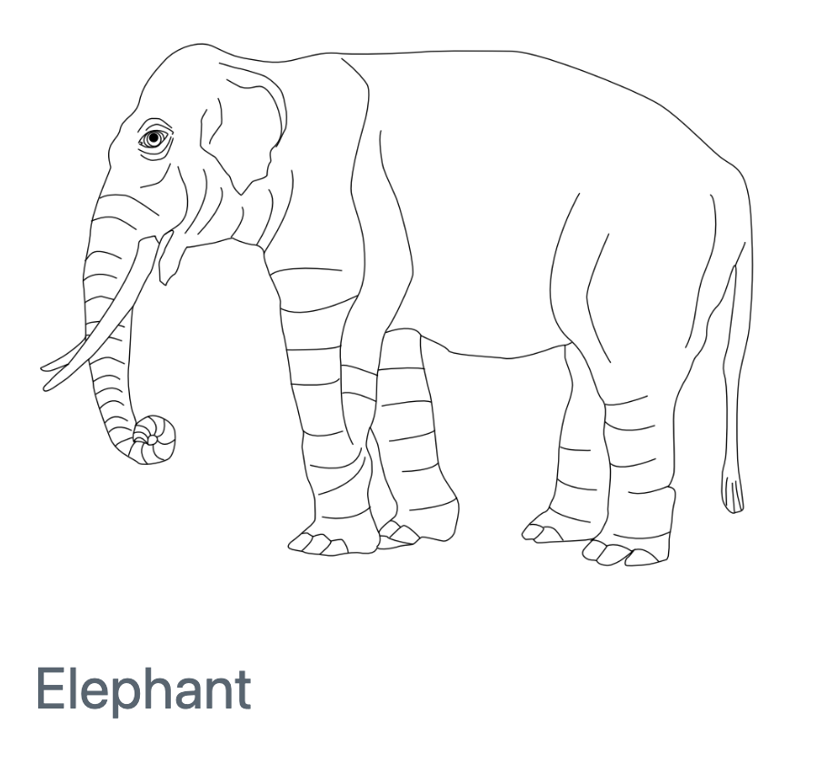
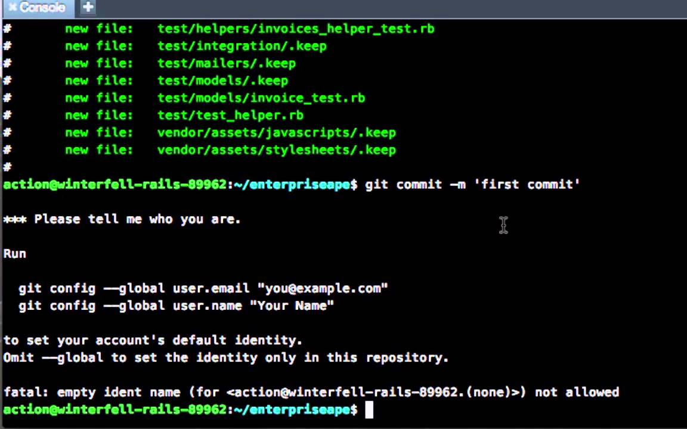

# Agenda

1.  Overview of Version Control in Pipeline Development \[Git, GitHub\]

2.  Introduction to Continuous Integration (CI) \[GitHub Action\]

3.  Best Practices & Practical Exercises

4.  Sharing, collaboration and nf-core resources

# Introduction to Version Control

