# Agenda

1.  Overview of Version Control in Pipeline Development \[Git, GitHub\]

2.  Introduction to Continuous Integration (CI) \[GitHub Action\]

3.  Best Practices & Practical Exercises

4.  Sharing, collaboration and nf-core resources

------------------------------------------------------------------------

# Introduction to Version Control

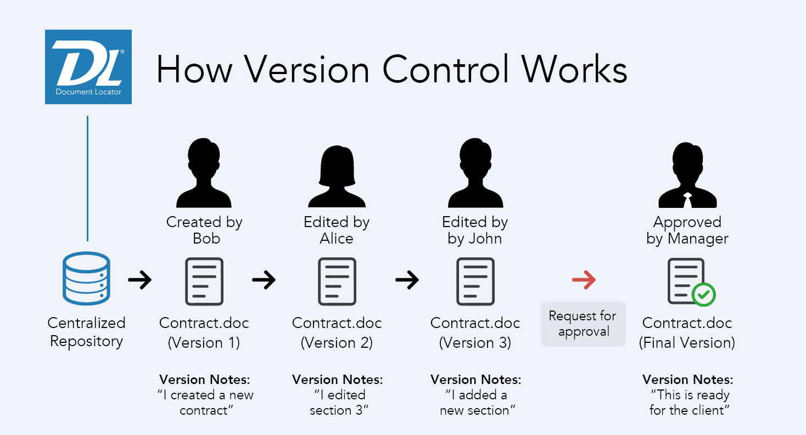

### **Definition**

Version control, also known as source control, is a way to track changes in your code. It uses special software to record every change in a database. If a mistake happens, developers can review earlier versions to fix the error without affecting everyone else. This system helps keep the code safe from major issues and small errors alike.

<https://www.atlassian.com/git/tutorials/what-is-version-control>

### **Benefits**

-   Collaboration

-   Work faster and smarter

-   History tracking

-   Reproducibility

# What is Git?

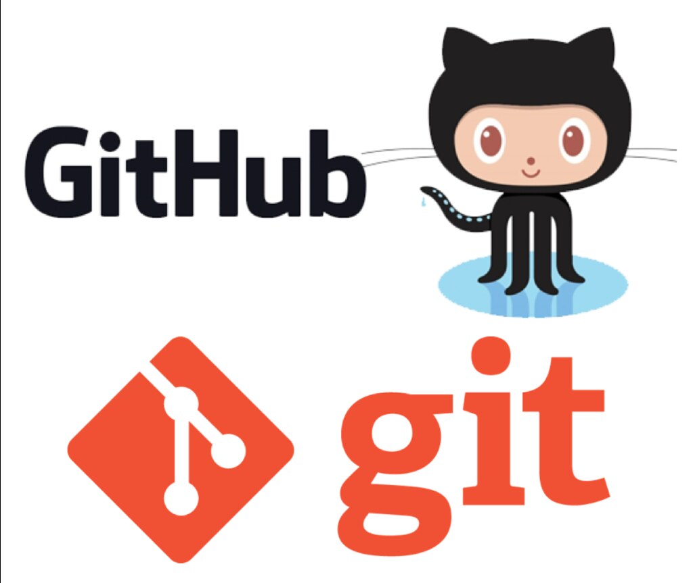

> Git is a distributed version control system that tracks changes in files—especially source code—and facilitates collaboration by allowing multiple developers to work on a project simultaneously.

Git is a mature, actively maintained open-source project originally developed in 2005 by Linus Torvalds, the famous creator of the Linux operating system kernel.


``` bash
# Check the status and view commit history
git status
git log --oneline
```

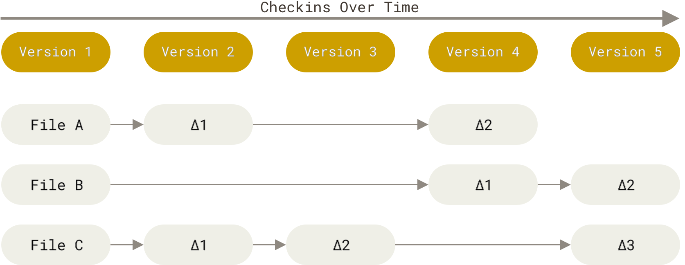

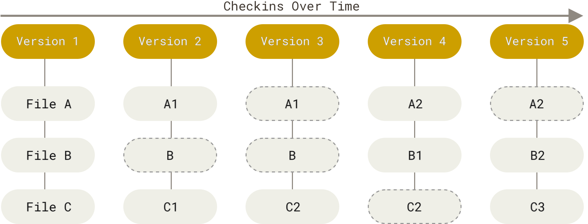

<https://git-scm.com/book/en/v2/Getting-Started-What-is-Git%3F>

------------------------------------------------------------------------

## Git Workflow Basics

### **Three Core Areas of a Git Repository**

-   **Working Directory:** The current files you see and edit on your local machine.

-   **Staging Area (Index):** A snapshot of changes that will be included in your next commit.

-   **Repository (History):** The complete record of commits made over time.

## The Typical Workflow

-   **Edit Files:** Make changes in the working directory.

-   **Stage Changes:** Use `git add` to move changes to the staging area.

``` bash
git add .
git add *
git add file.txt
```

-   **Commit:** Use git commit to permanently record the changes in the repository.

``` bash
git commit -m "update README.md"
```

## Basic Command

### Initializing a Repository

``` bash
git init my_project
```

This command creates a new Git repository in the "my_project" directory, setting up the structure needed for version control.

### Staging and Committing Changes

``` bash
git add index.html
git commit -m "Add initial HTML file"
```

The `git add` command stages the changes in the file for commit, while the git commit records the snapshot with a descriptive message.

### Viewing Commit History

``` bash
git log
```

Displays a chronological list of commits, allowing you to review what changes were made, by whom, and when.

------------------------------------------------------------------------

# What is GitHub?


### Definition

GitHub is a web-based platform that hosts Git repositories, offering additional features for collaboration, code review, and project management.

### Key Features

-   **Remote Repositories:** Host your code online, accessible from anywhere.

-   **Collaboration Tools:** Pull requests, issues, wikis, and integrated CI/CD tools help teams collaborate effectively.

-   **Social Coding:** GitHub’s interface supports community-driven development with stars, forks, and contributions.

::: callout-note
A team of developers can work on a project by forking a repository, creating branches for new features, and collaborating via pull requests to integrate improvements
:::

## Setting Up a GitHub Repository

### Creating a New Repository

Steps:

1.  Log in to GitHub and click the “New Repository” button.

2.  Provide a repository name, an optional description, and choose whether the repository is public or private.

3.  Optionally, initialize with a README file to describe the project.

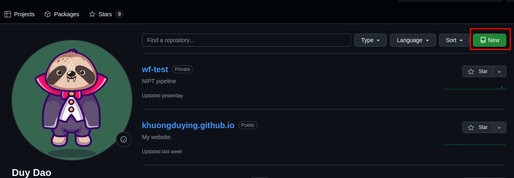

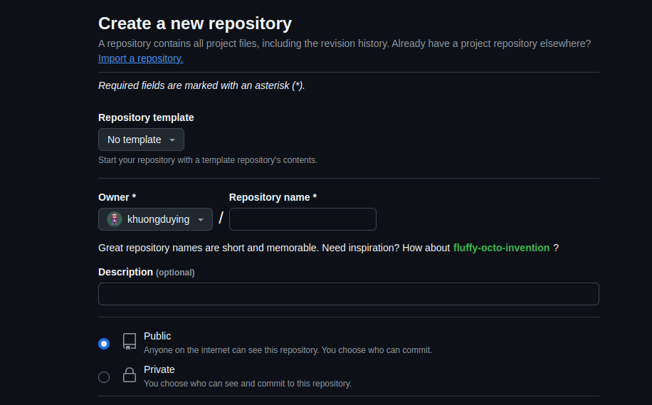

### Connecting Local Git to GitHub

Copy the URL when the repo created.

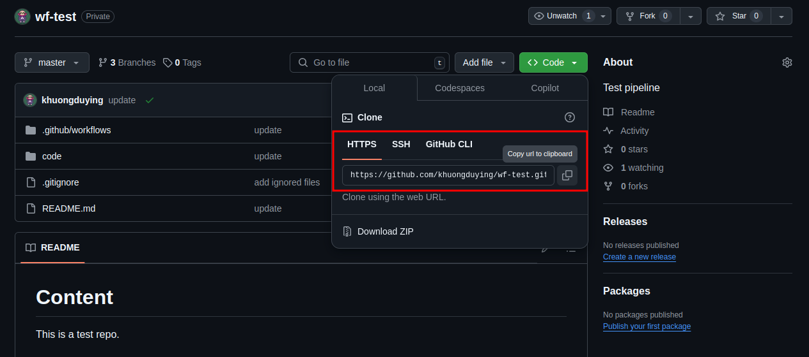

``` bash
git remote add origin https://github.com/username/my_project.git
git push -u origin master
```

Explanation:

-   `git remote add origin` sets the URL of the remote repository.

-   `git push -u origin master` uploads your local commits to the GitHub repository and sets the upstream branch for future pushes.

::: callout-tip
## **Use meaningful repository names and clear README documentation to ensure that others understand your project quickly.**
:::

------------------------------------------------------------------------

# Collaborating on GitHub – Branches & Pull Requests

## Branching Model for Collaboration

### Creating a Branch

``` bash
git checkout -b feature/new-feature
```

This creates and switches you to a new branch where you can develop a new user interface without affecting the main code.

### Merging Branches

After development, merge the feature branch back into the main branch using a pull request.

\<\< Example \>\>

### Pull Requests (PR)

Developers open a pull request on GitHub to propose changes, allowing team members to review, comment, and discuss the modifications.

\<\< Example \>\>

### Code Review Process

A structured review process helps maintain code quality and ensures that multiple perspectives are considered before merging.

\<\< Example \>\>

------------------------------------------------------------------------

# Advanced Git Commands & Techniques

## Merging Branches

``` bash
git checkout master
git merge feature/new-ui
```

Merges changes from the feature branch into the master branch.

## Merge Conflicts

-   Occur when changes in two branches conflict. Resolve by editing the files manually and then completing the merge.

-   Use tools like git mergetool for guided resolution.

## Rebasing

Rebasing rewrites commit history to create a linear progression of changes, which can make the project history cleaner.

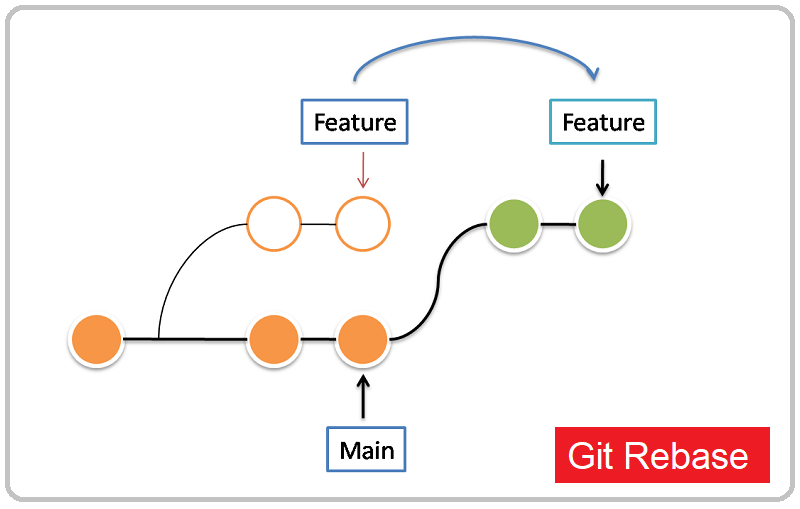

## Difference between Merge and Rebase

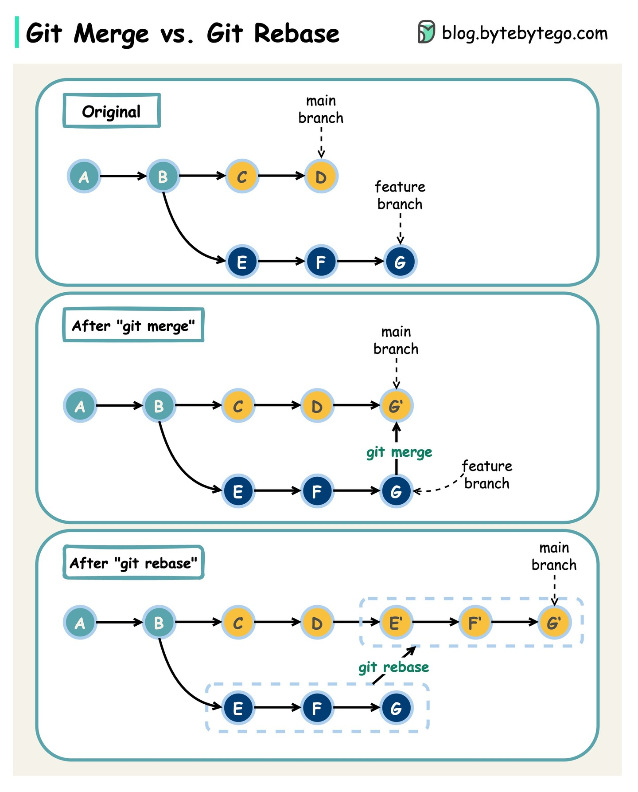

------------------------------------------------------------------------

# Best Practices for Storing Pipelines in Git

\<\< Set up a Git repo and connect to the remote \>\>

Link: <https://khuongduying.github.io/best_practice/git/setup_remote_repo.html>

---

# Git Workflow & Branching Strategies

-   Introduction to GitFlow and feature branches

-   Manage development vs. stable releases

GitFlow is a branching model for Git that provides a structured workflow for managing software development. Introduced by Vincent Driessen (<https://nvie.com/posts/a-successful-git-branching-model/> ), it outlines specific branch roles to organize your repository efficiently:

-   **Master/Main:** Contains the production-ready code.

-   **Develop:** Serves as the integration branch for features.

-   **Feature Branches:** Created off the develop branch for new features.

-   **Release Branches:** Used to prepare a new production release.

-   **Hotfix Branches:** For urgent fixes in the production code.

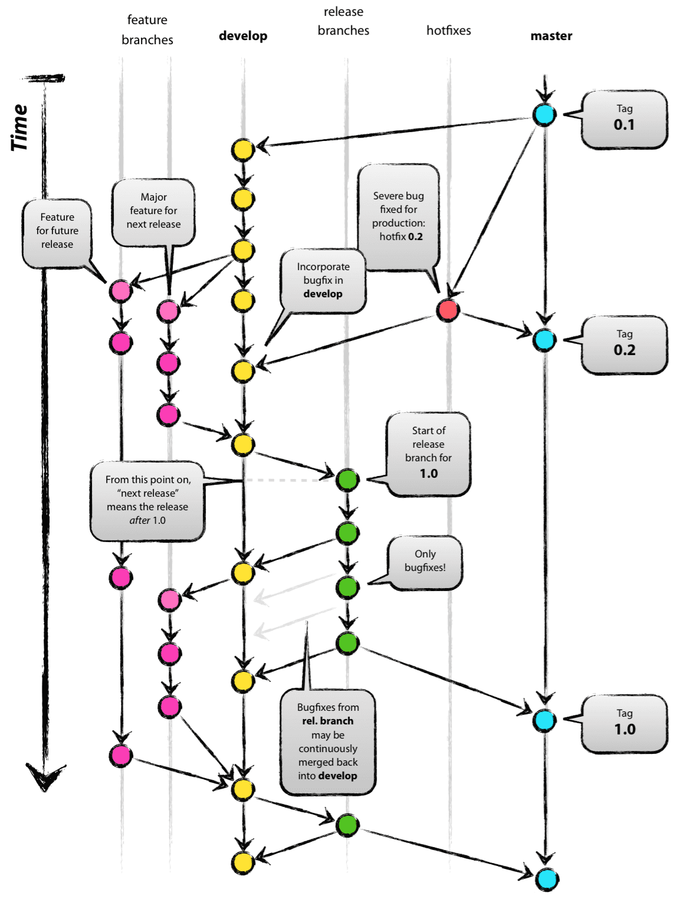

### More References

<https://www.atlassian.com/git/tutorials/comparing-workflows/gitflow-workflow>

## Install GitFlow

``` bash
# Install git-flow
sudo apt-get install git-flow
```

## Initialize Git Flow in Your Repository

``` bash
# Initialize GitFlow and start a new feature branch
git flow init
```

This command will ask you a series of questions about branch naming conventions (e.g., master/main, develop, feature, release, hotfix). You can usually accept the defaults.

## Working with Feature Branches

### Start a Feature

``` bash
git flow feature start add-new-module
```

### Work on Your Feature

Make your changes, and commit them as usual:

``` bash
git add .
git commit -m "Add new feature"
```

### Finish the Feature

Once your feature is complete, finish it to merge it back into develop

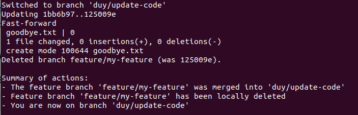

---

# Pipeline Versioning Strategies

## Introduction to Semantic Versioning (SemVer)

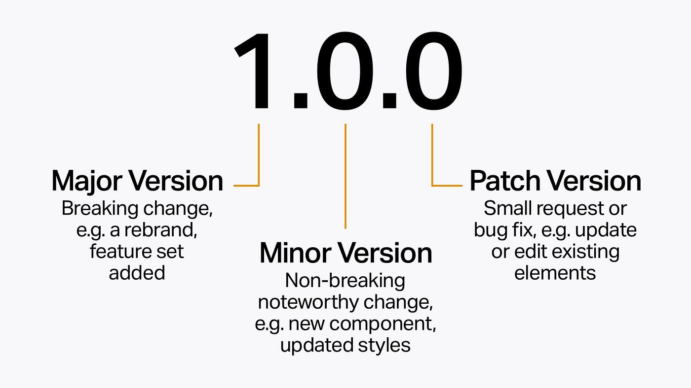