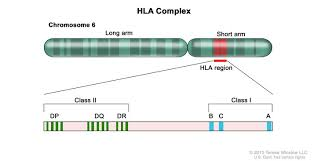
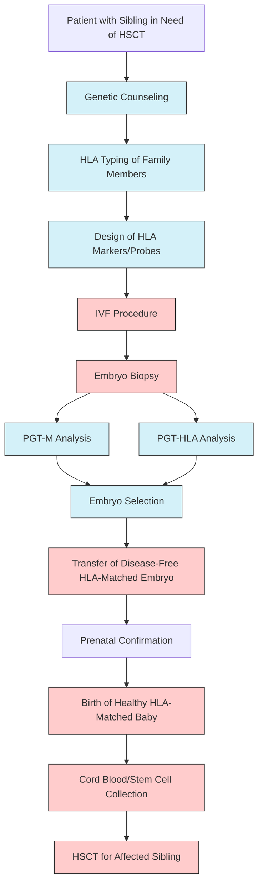
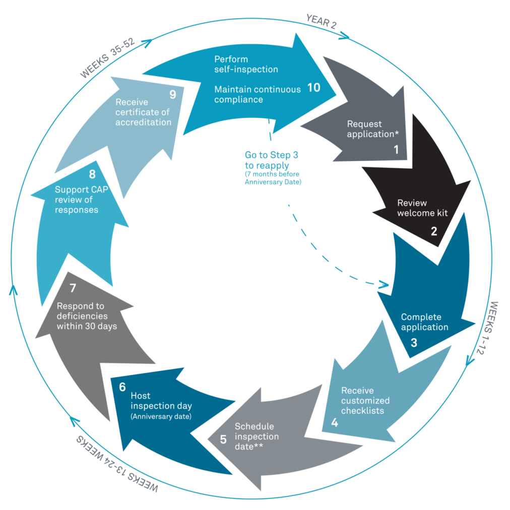

# PGT-A/M/SR
(Tran Van Thong, MD)

Linkage Analysis

Haplotyping

STR
SNP

PGT-M: STRs vs SNPs

karyomapping (phacogen)

PGT-SR bất thường cấu trúc cân bằng

robersinian translocation

how to find it?

only do in Fish

normal phoi

how to choose the embryo that don't carry the balanced translocation?

parents have structural balanced translocation

linkage

UPD - target region
UPD/ROH

UPD: Uniparental Disomy
ROH: Region of Homozygosity

Integrate SNP in PGT

---

# Journal from disease to healthy baby
(Prof Nguyen Dang Ton - Genome)

monogenic

Polygenic

roi loan NST

Benh lien ket gioi tinh

Gene-phenotype Relationships

\>7000 benh di truyen

Genetic testing --> IVF --> PGT --> Healthy baby

---

# Infertility in Male
(Dr. Nguyen Khac Han Hoan)

mat doan azf
klinefelter

CBAVD
Kallmann

Epigenetics

---

# PGT-TOTAL
(Le Ngoc Yen)

Robertsionian translocation
Reciprocal Translocation

Marker STR for PGT-SR

Breakpoint

Sang loc da ton thuong

PGT-TOTAL took 14 days for return result

---

# PGT-HLA Matching
(Ma Pham Que Mai, MsC)

Preimplantation Genetic Testing-Huamn Leukeocyte Antigen (PGT-HLA)

related to PGT-M

can combine with PGT-M

Chromosome 6

HLA region

https://visualsonline.cancer.gov/details.cfm?imageid=10431

Find Embryo has HLA match with the affected sib

Pre-PGT --> IVF --> PGT-M & PGT-HLA --> Transfer HLA-matched embryo

Deal with healthy embryo but not HLA-matched?

STR linkage

**Figure:** PGT-HLA Workflow for Stem Cell Donor Selection

**Reference**: Based on workflow described in Kahraman et al. (2021) "Current clinical application of preimplantation genetic testing for human leukocyte antigen matching: a systematic review." Human Reproduction Update, 27(5):885-903.

Success rate low
High cost

---
Fragile X Syndrome

---
# Notes

Genome use Ion Torrent NGS platform, Ion Reporter software, Thermo

Genome Company was accredited by CAP
https://www.cap.org/laboratory-improvement/accreditation/laboratory-accreditation-program

Gen QA
https://genqa.org/

