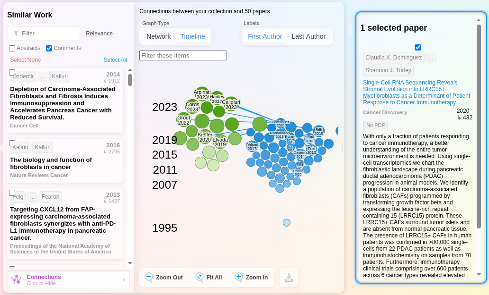

# Tools for Making a Scientific Project

A personal collection for free and effective tools in scientific writing.

## Literature Review

1.  Find a good Review article (written around 5-10 years)

2.  Finding general knowledge and references in the research field using Perplexity AI

3.  Finding papers for a subject:

-   PubMed: https://pubmed.ncbi.nlm.nih.gov
-   Google `:))`

## Reference Manager (Zotero)

-   Collections, sub-collections
-   Given one project a sub-collection
-   Color the tags (i.e. must read, completed,...)

## Find Related Researchs

### [researchrabbit.ai](https://www.researchrabbit.ai/reviews)

Upload the Zotero research to this and find other relatives. 

### Perplexity (Again!)

Useful for asking questions.

## Narrative Reviews

> A narrative review is a comprehensive, critical analysis of the literature on a specific topic that synthesizes published information without using systematic methods to identify, select, and evaluate studies.

**An example table of narrative reviews** \| Theme \| Key Findings \| Representative Studies \| Implications \| \|-------\|-------------\|------------------------\|--------------\| \| Microbiome and Mental Health \| Growing evidence links gut microbiota composition to depression and anxiety \| Johnson et al. (2019), Zhang & Lee (2020), Patel (2022) \| Suggests potential for microbiome-targeted therapies \| \| Therapeutic Approaches \| Probiotics show modest effects on symptoms in some studies; prebiotics emerging as alternative \| Miller et al. (2018), Sánchez-Rodríguez (2021), Chen (2023) \| Clinical applications remain preliminary; more RCTs needed \| \| Mechanisms of Action \| Inflammation, HPA axis regulation, and neurotransmitter production implicated \| Davidson (2020), Williams & Thompson (2019) \| Multiple pathways likely involved; personalized approaches may be necessary \| \| Methodological Challenges \| Heterogeneity in study designs, small sample sizes, and varied microbiome assessment techniques \| Review by García (2021) \| Need for standardized protocols and larger studies \| \| Future Directions \| Integration of multi-omics data and longitudinal designs \| Proposed by Wong et al. (2022) \| Moving toward precision medicine approaches \|

## Data Analysing (in bioinformatics concept)

-   Data collecting
-   Data pre-processing
-   Data analysing
-   Meta-analysing

## Writing

Quarto Project

Markdown only

VScode IDE (with Zen mode)

## Citation

Zotero

## Plagiarism Checks

## Presentation

Talk about my research

-   Google Slide

Participating in conferences.

## Research Profiling Express

-   Google Scholar
-   Research Gate
-   LinkedIn
-   

> Hello World
>
> This is from the future
>
> > Nevertheless