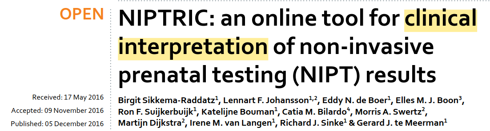
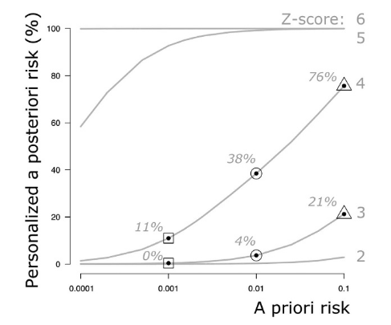
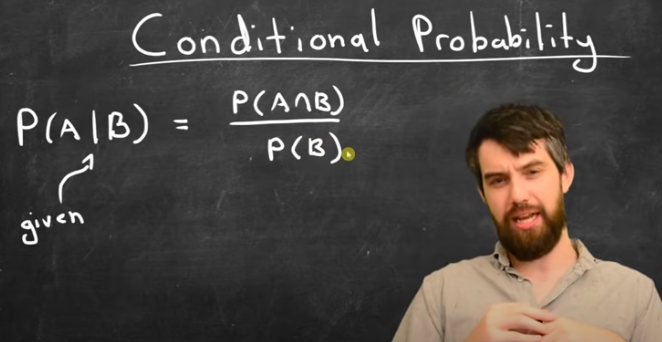
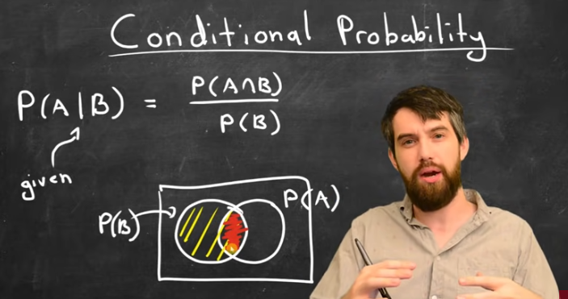
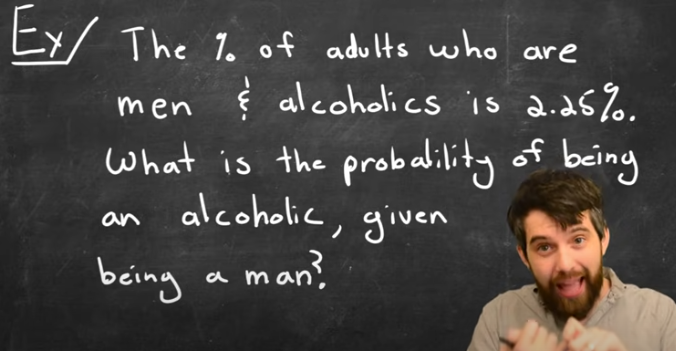
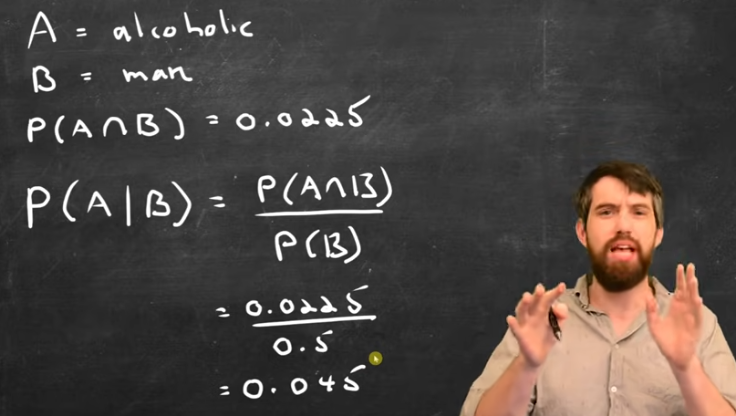

# Risk Score

## Terminology

Risk factors (priori risk): - Maternal age - Likelihood from nuchal translucency thickness - Serum pregnancy-associated plasma protein-A - Serum free B-human chorionic gonadotropin and plasma cfDNA

Positive likelihood ratio (trisomic/euploid) Negative likelihood ratio (euploid/trisomic)

Posteriori risk (Sikkema-Raddatz et al., 2016) \> True likelihood of carrying a foetus with trisomy

Conditional Probability (https://en.wikipedia.org/wiki/Conditional_probability)

## Reference Application

### NIPTRIC: an online tool for clinical interpretation of non-invasive prenatal testing (NIPT) results



The tool takes input: - a priori risk - z-score

Output: - PPR (posteriori risk)

> "For z\<5, PPR is considerably higher at a high a priori risk than at a low a priori risk"

> "The PPR is effectively **independent** under all conditions for Z-scores above 6"

#### What is an "a priori risk"?



# Conditional Probability

Conditional probability is the foundation of the Bayesian approach used in NIPT. Let's break it down using intuitive examples from prenatal testing.

## The Basic Concept

Conditional probability is about how the probability of one event changes when we know another event has occurred.

We write it as `P(A|B)`, which means "the probability of A given that B has happened."

## NIPT Example: Understanding Conditional Probability

Let's work with a concrete example:

**1. Basic Probabilities in NIPT**

-   `P(T21)` = Probability a baby has trisomy 21 (Down syndrome)

-   `P(Positive)` = Probability of getting a positive test result

-   `P(T21|Positive)` = Probability baby has Down syndrome given a positive test

-   `P(Positive|T21)` = Probability of a positive test given the baby has Down syndrome

**2. Real-World NIPT Scenario**

Imagine 10,000 pregnant women being tested:

-   100 babies have Down syndrome (`P(T21)` = 100/10,000 = 0.01 or 1%)
-   99 of those 100 babies with Down syndrome test positive (`sensitivity` = 99%)
-   9,900 babies don't have Down syndrome
-   10 of those 9,900 babies without Down syndrome test positive (`false positive rate` = 0.1%)
-   Total positive tests: 99 + 10 = 109

**3. Conditional Probability in Action**

`P(Positive|T21) = 99/100 = 0.99 (99%)`

This is the test sensitivity

> "If a baby has Down syndrome, there's a 99% chance the test is positive"

`P(T21|Positive) = 99/109 ≈ 0.908 (90.8%)`

This is the positive predictive value

> "If the test is positive, there's a 90.8% chance the baby has Down syndrome"

## Why Z-scores Matter in Conditional Probability

The z-score in NIPT is a continuous measure, not a binary yes/no:

-   `P(T21|z=3)` might be 50%
-   `P(T21|z=5)` might be 80%
-   `P(T21|z=7)` might be 95%

> This shows how the condition (the z-score value) dramatically changes the probability of the baby having Down syndrome.

## How Prior Risk Affects Conditional Probability

For a 25-year-old mother (baseline risk 0.1%):

-   Out of 10,000 pregnancies, only 10 babies have Down syndrome (`P(T21)`)

-   With the same test characteristics, a positive result gives `P(T21|Positive)` ≈ 50%

-   This demonstrates how the conditional probability `P(T21|Positive)` depends heavily on the population being tested.

## Example: Visualizing Conditional Probability in NIPT

```{r}
#| label: conditional-probability-nipt
#| fig.width: 9
#| fig.height: 6
#| warning: false
#| message: false

library(tidyverse)
library(scales)
library(kableExtra)

# Create a dataframe showing relationship between z-scores and conditional probability
# Based on realistic but simulated data

# Z-score range
z_scores <- seq(1, 8, by = 0.5)

# Function to calculate P(T21|z) for different age groups
# Parameters estimated based on typical NIPT results
calculate_pt21_given_z <- function(z, prior_risk) {
  # Likelihood ratio increases exponentially with z-score
  lr <- exp(0.8 * z - 2)
  # Apply Bayes theorem
  posterior <- (prior_risk * lr) / (prior_risk * lr + (1 - prior_risk))
  return(posterior)
}

# Create dataframe with probabilities for different age groups
nipt_df <- expand.grid(
  z_score = z_scores,
  age_group = c("20-25 yrs (0.1%)", "30-35 yrs (0.3%)", "35-40 yrs (0.8%)", "40+ yrs (1.5%)")
)

# Set prior risks based on age groups
prior_risks <- c(0.001, 0.003, 0.008, 0.015)
names(prior_risks) <- c("20-25 yrs (0.1%)", "30-35 yrs (0.3%)", "35-40 yrs (0.8%)", "40+ yrs (1.5%)")

# Calculate conditional probabilities
nipt_df$conditional_prob <- mapply(
  calculate_pt21_given_z,
  nipt_df$z_score,
  prior_risks[nipt_df$age_group]
)

# Create visualization
ggplot(nipt_df, aes(x = z_score, y = conditional_prob, color = age_group)) +
  geom_line(size = 1.2) +
  geom_point(size = 3, alpha = 0.7) +
  scale_y_continuous(labels = percent_format(), limits = c(0, 1)) +
  scale_color_brewer(palette = "Set1") +
  labs(
    title = "Conditional Probability P(T21|z-score) by Maternal Age",
    subtitle = "How the probability of Down syndrome changes based on z-score and prior risk",
    x = "NIPT z-score",
    y = "P(T21|z-score) - Probability of Down Syndrome",
    color = "Maternal Age Group\n(Prior Risk)"
  ) +
  theme_minimal(base_size = 12) +
  theme(
    legend.position = "right",
    panel.grid.minor = element_blank(),
    plot.title = element_text(face = "bold"),
    plot.subtitle = element_text(face = "italic")
  ) +
  geom_hline(yintercept = 0.5, linetype = "dashed", color = "darkgray") +
  annotate("text", x = 1.5, y = 0.55, label = "50% probability threshold", color = "darkgray")

# Create a sample data table for the explanation
sample_data <- data.frame(
  z_score = c(3, 3, 3, 3, 7, 7, 7, 7),
  age_group = rep(c("20-25 yrs", "30-35 yrs", "35-40 yrs", "40+ yrs"), 2),
  prior_risk = rep(c(0.001, 0.003, 0.008, 0.015), 2),
  posterior_risk = c(
    0.018, 0.052, 0.129, 0.219,  # For z=3
    0.883, 0.957, 0.985, 0.992   # For z=7
  )
)

# # Display the table
# kable(sample_data, 
#       col.names = c("Z-score", "Age Group", "Prior Risk", "Posterior Risk P(T21|z)"),
#       caption = "Example of how conditional probability changes with z-score and prior risk") %>%
#   kable_styling(bootstrap_options = c("striped", "hover", "condensed")) %>%
#   row_spec(0, bold = TRUE) %>%
#   row_spec(4:8, background = "#ffffd9")
```

```         
```

## Intuitive Takeaways

-   **Context matters**: The meaning of a positive test depends on who's being tested

-   **Conditioning changes probabilities**: The probability of Down syndrome changes dramatically when conditioned on test results

-   **Visual intuition**: The higher the z-score, the more it "conditions" our understanding of the risk

-   **Practical interpretation**: When a doctor says "given your positive test and age, your risk is X%," they're applying conditional probability

Conditional probability helps us understand that test results don't exist in isolation—they must be interpreted in the context of prior risk factors and test performance characteristics.

## References & Learning resources

https://en.wikipedia.org/wiki/Conditional_probability

1.  Intro to Conditional Probability: [Youtube](https://www.youtube.com/watch?v=ibINrxJLvlM)









2.  Two Conditional Probability Examples (what's the difference???) [Youtube](https://www.youtube.com/watch?v=OYT0AcuLXu8)

# Bayesian's Theorem

Bayes's Theorem is about updating our prior beliefs when we get new evidence:

## The Basic Intuition

```         
Posterior = (Prior × Likelihood) / Evidence
```

> What we believe after the test = (What we believed before x How likely the test result is if the condition exists) / Overall chance of seeing this test result

## The Full Bayes' Theorem

First, let's understand the general form:

$$
P(A|B) = \frac{P(B|A) \times P(A)}{P(B)}
$$

Where:

-   **P(A\|B)** = Probability of A given B (posterior)
-   **P(B\|A)** = Probability of B given A (likelihood)
-   **P(A)** = Prior probability of A
-   **P(B)** = Overall probability of B

**Translating to our NIPT example:**

-   **A** = "Baby has Down syndrome"
-   **B** = "Test came back positive"
-   **P(A)** = Prior probability = 1/100 (1% risk based on maternal age)
-   **P(B\|A)** = Sensitivity = 0.99 (99% chance of positive test if Down syndrome present)
-   **P(B\|not A)** = False positive rate = 0.001 (0.1% chance of positive test if no Down syndrome)

> How can I get the `prior probability`?

> Does it only contains the maternal age, or it has others risk factors? If so, how to combine multiple factor?

## NIPT Application Example

Let's use NIPT for trisomy 21 (Down syndrome) as our example:

**1. Start with the Prior Risk** - For a 40-year-old mother, the prior risk might be 1/100 (1%) - For a 25-year-old mother, the prior risk might be 1/1000 (0.1%)

**2. Understand the Test Performance** - Sensitivity: \~99% (if trisomy exists, test will be positive 99% of time) - Specificity: \~99.9% (if no trisomy, test will be negative 99.9% of time)

**3. Get a Test Result (z-score)** - Higher z-scores (\>5) suggest higher likelihood of trisomy

```         
> This is your `"new evidence"`
```

**4. Update the `Prior Risk` to Get `Posterior Risk`**

For a 40-year-old with a high z-score (z=7):

$$
\text{Posterior Risk} = \frac{\frac{1}{100} \times 0.99}{\left(\frac{1}{100} \times 0.99\right) + \left(\frac{99}{100} \times 0.001\right)}
\approx 0.99 \text{ or } 99\%
$$

**Breaking Down Each Component**

-   Prior: P(A) = 1/100 = 0.01 \> This is the baseline risk for a 40-year-old mother before any testing Likelihood: P(B\|A) = 0.99 \> \> If the baby has Down syndrome, there's a 99% chance the test detects it

-   Denominator Expansion: \> `P(B) = P(B|A)×P(A) + P(B|not A)×P(not A)`

-   The overall probability of getting a positive test result

P(not A) = 1 - P(A) = 1 - 0.01 = 0.99 (99% chance of no Down syndrome)

P(B\|not A) = 0.001 (0.1% false positive rate)

**Interpretation**

This means that for a 40-year-old mother with this particular positive test result:

-   Before the test, her risk was 1% (prior)
-   After receiving this positive result, her risk is now \~91% (posterior)
-   The test has dramatically increased our confidence that the baby has Down syndrome

**Why This Makes Intuitive Sense** - We started with a modest risk (1%) - We received strong evidence (positive test with 99% sensitivity and 99.9% specificity) - This evidence dramatically shifted our belief from 1% to \~91%

------------------------------------------------------------------------

For a 25-year-old with the same z-score ($z=7$):

$$
\text{Posterior Risk} = \frac{\frac{1}{1000} \times 0.99}{\left(\frac{1}{1000} \times 0.99\right) + \left(\frac{999}{1000} \times 0.001\right)}
\approx 0.50 \text{ or } 50\%
$$

## Key Insights from the NIPT Example

-   **Prior matters for moderate test results**: With z-scores below 5, the posterior risk is highly dependent on the prior risk (maternal age, etc.)

-   **Strong evidence can overwhelm priors**: For z-scores above 6, the test result is so strong that the posterior risk becomes nearly independent of the prior risk

-   **Visualization**: The tool (i.e. in NIPTRIC case) visualizes exactly this relationship - showing how as test evidence gets stronger (higher z-scores), the initial risk factors matter less

-   **Practical use**: Doctors use this Bayesian approach to give personalized risk assessments rather than binary "positive/negative" results

This is Bayes' Theorem in action - we start with what we know (prior), incorporate new evidence (test result), and arrive at an updated belief (posterior risk).